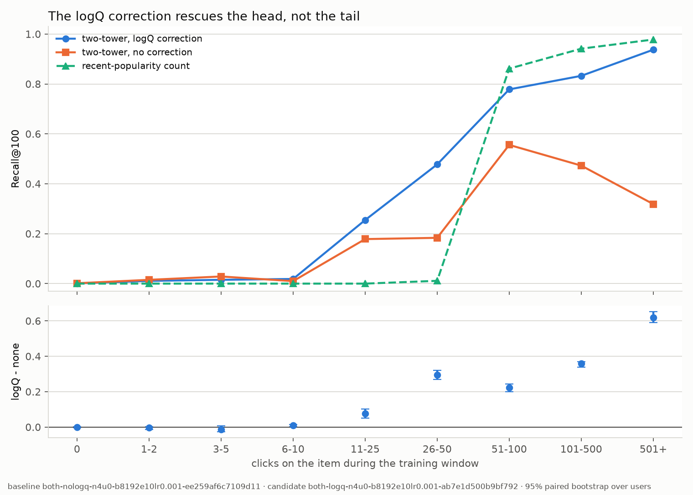
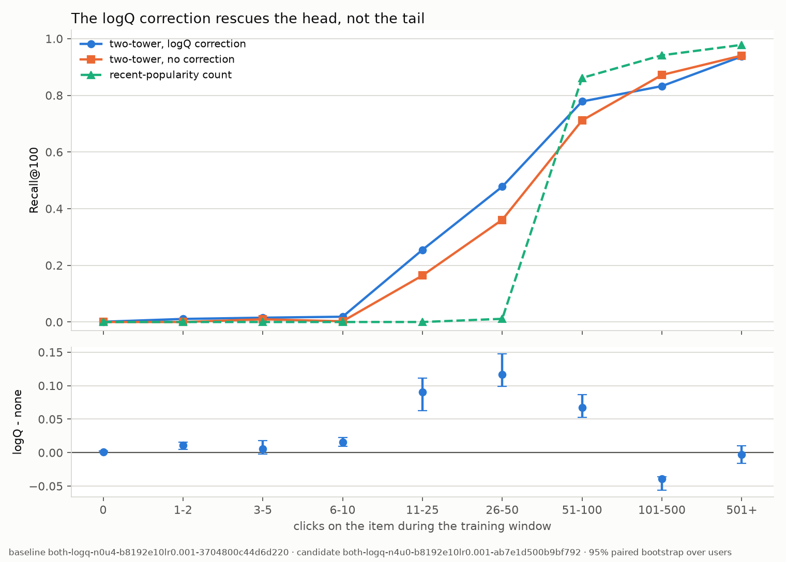
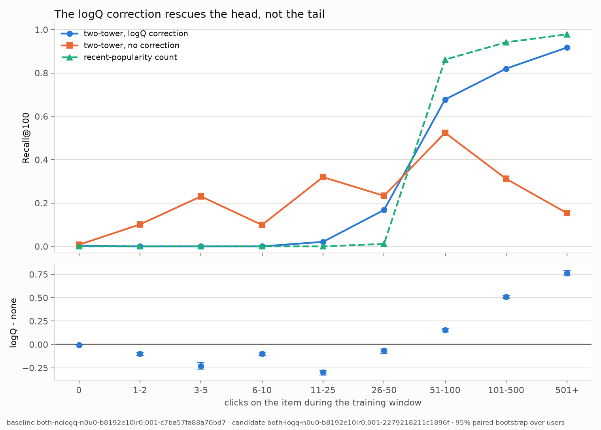

# Retrieval

**Nothing here is comparable to anything in [baselines.md](baselines.md).** That
table ranks the ~37 items MSN already chose; everything here asks a model to find
the clicked article in a **65,239-row catalogue**. Different candidate set,
different denominator, different question.

## The setup, once

Validation is the **last 12 hours of TRAIN**, carved by `--holdout-hours 12`:
**19,006 clicks over 9,943 distinct users**, 217,094 rows left to train on. Not
dev -- dev is 88% cold users and would answer a different question. The metric
is **Recall@100 over the full item table**, row 0 (the reserved OOV index)
dropped before the top-k.

Every comparison below is a **paired bootstrap over USERS**, 10,000 resamples,
with both arms scored on the same rows. `models/retrieval/ablation.py` refuses
to pair two runs whose `item_ids`, `user_ids` or banding differ -- a paired
interval is narrow *because* row *i* is the same request in both files, and two
arms scored over different holdout windows would still pair row-for-row and
still return a confident number about nothing.

### Bands, and why they are fixed

Rows are grouped by the clicked item's **click count over the whole training
window**: `0 | 1-2 | 3-5 | 6-10 | 11-25 | 26-50 | 51-100 | 101-500 | 501+`.
Deciles are impossible here -- **28.5% of validation rows sit on items with zero
training clicks**, so three of an eleven-boundary decile cut land on the same
value. Fixed edges also survive a change of holdout window, so two plots stay
comparable.

`<26` is the **long tail**, and the edge is derived rather than chosen: the
counting baseline `pop@100` is exactly **0.0000** for every band below 26, so 26
is where a popularity retriever stops existing. **28.5% of validation clicks are
unreachable by any counting retriever.**

### The reference points

| retriever | Recall@100 |
| --- | ---: |
| random | 0.0015 |
| point-in-time popularity -- top 100 from the prior 12h | **0.3523** |
| best two-tower measured here | **0.3776** |
| oracle popularity -- top 100 *of the window itself* | **0.6966** |

**A metric without a ceiling is not a result.** 0.3776 reads as impressive
against random and mediocre against the oracle, and the second reading is the
right one. The ~0.32 gap to the oracle is almost entirely "what is popular right
now", which the item tower **deliberately cannot see** -- no `item_ctr_smoothed`,
no `item_age_hours`, because an embedding that moves hourly is an ANN index that
must be rebuilt hourly. **That gap is the measured price of a static index**, and
it is the argument for Part I's blending.

Note also that "65,238 candidates" overstates the task by ~54x: only **1,205
distinct articles are clicked in the window at all**, and 98.9% of clicks fall in
the top 1,000 by popularity.

---

## Item Tower

Three arms, identical settings and split, differing only in which inputs the
item tower gets. `use_content=False` drops the sentence vectors **and** the
category/subcategory embeddings together, so the "ID only" arm genuinely cannot
represent a brand-new article.

| band | rows | ID only | content only | **both** | pop@100 |
| --- | ---: | ---: | ---: | ---: | ---: |
| 0 -- cold | 5,409 | 0.0000 | **0.0046** | 0.0009 | 0.0000 |
| 1-2 | 1,386 | 0.0000 | 0.0000 | **0.0108** | 0.0000 |
| 3-5 | 525 | 0.0000 | **0.0381** | 0.0152 | 0.0000 |
| 6-10 | 1,505 | 0.0000 | 0.0020 | **0.0186** | 0.0000 |
| 11-25 | 1,390 | 0.0928 | 0.1460 | **0.2547** | 0.0000 |
| 26-50 | 1,608 | 0.3489 | **0.4801** | 0.4776 | 0.0112 |
| 51-100 | 1,479 | 0.7451 | 0.7728 | **0.7782** | 0.8614 |
| 101-500 | 4,750 | 0.8312 | **0.8469** | 0.8324 | 0.9413 |
| 501+ | 954 | 0.9287 | **0.9371** | 0.9371 | 0.9780 |
| **overall** | 19,006 | **0.3486** | **0.3727** | **0.3776** | 0.3523 |

`both - ID only`: **+0.0290** [+0.0232, +0.0322].
`both - content only`: **+0.0049** [+0.0008, +0.0092].

> ⚠️ **The second of those two deltas does not survive reseeding.** Part H
> measured run-to-run variance for the first time: sigma = 0.0073 across four
> seeds of the `both` arm, so a difference between two independently trained
> models carries sd ~ 0.0103. +0.0049 is half of one sigma, and the arm means
> over seeds put content-only *ahead*. See
> [Seed variance](#seed-variance-and-what-it-costs-this-page) at the foot of this
> page. The `both - ID only` delta at +0.0290 is ~2.8x that sd and stands.

**1. The item ID embedding is close to dead weight.** Content-only reaches
**98.7% of the full model's recall with no ID table at all**. That table is
65,239 x 64 = **4.2M parameters**, more than the rest of the model, and it buys
an interval that barely clears zero.

**2. And it makes cold-start actively worse.** Content-only scores 0.0046 in the
cold band; adding the ID drops it to 0.0009, significantly
([-0.0056, -0.0020]). Same at 3-5 clicks: 0.0381 -> 0.0152. **An untrained ID
embedding is noise the item tower cannot ignore**, and block normalisation gives
it a fixed share of the input energy whether or not it carries signal.

**3. ID-only loses to counting.** 0.3486 against the prior-12h baseline's 0.3523
-- a 4.2M-parameter learned retriever beaten by `sort by recent clicks`. It is
exactly 0.0000 in every band below 11 clicks, which is the correct behaviour of
an untrained embedding and the cleanest illustration of why content is in the
model.

**4. One place the inputs genuinely combine.** Band 11-25: ID 0.0928,
content 0.1460, both **0.2547** -- well above either. That is the regime where an
item has enough clicks for its ID to mean something and still needs content to be
told apart from its neighbours. Everywhere else `both` matches or trails
content-only.

**Read the four bands below 11 clicks as one statement**, not four results: all
arms under 4%, content-only the only one above chance. They are 20-25 hits each
and the sign flips between them are not interpretable.

**A confound, stated rather than corrected.** The content-only arm carries an
extra `history_proj` (768x64, bias-free) that the others do not -- the deliberate
capacity-parity choice from G1b, so every arm feeds the user tower the same
width.

**This is a measured challenge to ADR 0005** ("embed the full catalogue, accept
that ~63% of rows never train"). Those rows are not merely idle; they are harmful
on exactly the requests the project cares about.

---

## The logQ correction

Two arms, one flag apart, at `b8192e10lr0.001` with **`--max-negs 4`** (pool
40,960 columns). That condition is load-bearing -- see the interaction below.



| band | rows | no logQ | **logQ** | delta | 95% CI | real |
| --- | ---: | ---: | ---: | ---: | --- | --- |
| 0 -- cold | 5,409 | 0.0015 | 0.0009 | -0.0006 | [-0.0021, +0.0012] | **no** |
| 1-2 | 1,386 | 0.0152 | 0.0108 | -0.0043 | [-0.0144, +0.0028] | **no** |
| 3-5 | 525 | 0.0286 | 0.0152 | -0.0133 | [-0.0268, +0.0080] | **no** |
| 6-10 | 1,505 | 0.0100 | 0.0186 | +0.0086 | [+0.0014, +0.0159] | yes |
| 11-25 | 1,390 | 0.1784 | 0.2547 | +0.0763 | [+0.0509, +0.1014] | yes |
| 26-50 | 1,608 | 0.1835 | 0.4776 | +0.2942 | [+0.2684, +0.3205] | yes |
| 51-100 | 1,479 | 0.5558 | 0.7782 | +0.2224 | [+0.1989, +0.2433] | yes |
| 101-500 | 4,750 | 0.4728 | 0.8324 | +0.3596 | [+0.3387, +0.3699] | yes |
| **501+** | 954 | **0.3187** | **0.9371** | **+0.6184** | [+0.5903, +0.6526] | yes |
| **overall** | 19,006 | **0.2091** | **0.3776** | **+0.1685** | [+0.1604, +0.1743] | yes |

**There is no band where removing the correction helps.** An earlier draft
claimed the three thinnest bands were better without it; all three intervals
contain zero. Do not quote a per-slice delta before its interval.

**The effect grows monotonically with popularity, to a 3x gap at 501+.** This is
the manual's own mechanism landing where the mechanism points: SS9.4's stated
reason for the correction is that in-batch negatives are drawn proportional to
popularity, so uncorrected the model under-ranks popular items. **0.3187 at 501+
is that sentence, measured.**

**Below 6 clicks -- 7,320 rows, 38.5% of validation -- this configuration shows
no effect in either direction.** That is a statement about this pool width, not
about the correction. The same ablation at 8,192 columns gets the largest tail
effect in the project, with the opposite sign.

**Multiplicity, stated.** Ten intervals at 95% expects ~0.5 false positives.
Eight of the nine significant results are enormous relative to their width. The
6-10 band is the marginal one (lower bound +0.0014), so the honest phrasing is
"the effect begins somewhere around ten clicks".

**The correction also protects the geometry**, which the manual does not claim:
the uncorrected arm's item effective rank troughs at **2.7** against the
corrected arm's **5.2**, and it early-stopped at 6 epochs instead of 10.

---

## The negative-source table

Four of the manual's five rows, same settings throughout. Row 4 (mined hard
negatives from ranks 50-500) is **deferred with a reason**: mining from a
retriever whose served universe is ~900 items would sample ranks 50-500 from that
same narrow set.

| # | negatives | pool columns | Recall@100 | long tail (<26) |
| --- | --- | ---: | ---: | ---: |
| 1 | in-batch only, no logQ | 8,192 | 0.1931 | **0.0875** |
| 2 | in-batch only, + logQ | 8,192 | 0.3202 | 0.0044 |
| 3 | + 4 uniform per row, + logQ | 40,960 | 0.3634 | 0.0232 |
| 5 | + 4 real slate negatives, + logQ | 40,960 | **0.3776** | 0.0401 |

### Where 40,960 comes from

The candidate pool is `B x (1 + K)`. Every row in the batch contributes its
**positive and its K sampled negatives**, and all of them are columns for every
other row. At `B=8192, K=4`: 8,192 positives + 32,768 negatives = **40,960
columns**, so each row scores against 40,959 negatives. Rows 1 and 2 set `K=0`,
so the pool is the batch itself -- 8,192 columns, 8,191 negatives per row.

**The pool is not "the negatives you configured".** It is the whole batch's
candidate set, which is why `--max-negs 4` multiplies the logits area by five,
and why B=16384 puts ~24 GB on the loss alone and OOMs.

### Support, not count

Rows 3 and 5 are matched on **count** and differ on **support** -- which items can
appear as a negative at all.

| source | distinct items it can draw | what it is |
| --- | ---: | --- |
| in-batch | **7,179** | items with any training-window click |
| slate | ~24,600 | items MSN actually showed alongside a click |
| uniform | **65,238** | the whole catalogue |

Calling rows 3 and 5 a matched pair is wrong: they are matched on count and not on
support, and the support difference is the finding.

### The gift, measured



Slate against uniform, both at 40,960 columns, paired per user:

| slice | delta | 95% CI |
| --- | ---: | --- |
| overall | **+0.0142** | [+0.0070, +0.0162] |
| long tail (<26) | **+0.0169** | [+0.0140, +0.0224] |
| 101-500 | **-0.0394** | significant |

> ⚠️ **The overall delta is marginal once seed variance is counted.** +0.0142
> against a between-run sd of ~0.0103 is ~1.4 sigma. The long-tail delta is the
> one to quote: it is both larger and the slice the mechanism predicts. See
> [Seed variance](#seed-variance-and-what-it-costs-this-page).

**The gift is worth more in the tail than in aggregate** -- the one place it was
supposed to be worth something. SS9.4 offers slate negatives as free hard
negatives; the measurement says they are also a **support** correction, because a
slate samples what was plausible *for that request* rather than the catalogue. It
loses in 101-500, where uniform's catalogue-wide support is the better teacher.

This is the payoff of choosing MIND: mining hard negatives normally needs a
trained model, a stale index and a rank floor to dodge unlabelled positives. MIND
logs impressions, so the non-clicked items of each slate were **actually seen and
actually declined**.

### The interaction -- the strongest result Part G produced

**The logQ ablation reverses sign in the long tail when the negatives change.**



| slice | at 40,960 columns (K=4 slate) | at 8,192 columns (in-batch only) |
| --- | ---: | ---: |
| long tail (<26) | +0.0002, **n.s.** | **-0.0831** [-0.0956, -0.0826] |
| 501+ | +0.6184 | **+0.7642** [+0.7335, +0.7890] |
| overall | +0.1685 | +0.1271 |

At 8,192 in-batch-only columns: **nine bands, nine significant intervals**, and
the correction is a monotone trade. It destroys **95% of long-tail recall**
(0.0875 -> 0.0044) to take 501+ from 0.1530 to 0.9172. The crossover sits
between 26 and 50 clicks.

**Mechanism.** `logits = (u.v)/T - log q` subtracts `log q` from every column
**including each row's own positive**. A popular item's positive logit is cut
hardest, so the model must work harder on exactly the rows whose answer is
popular -- and it pays for that out of the rare rows. **logQ reallocates capacity
from rare items to popular ones.** It is not a tail-fairness correction, and
SS9.4's prediction that it "should measurably help the long tail" has it
backwards.

**Why the effect hides at K=4.** With 32,768 real impression negatives in the
pool, the batch is no longer the sampling distribution, so `q` -- estimated over
what was actually drawn -- is a weaker signal and the tail effect collapses to a
null.

**This interaction is the one result on this page that seed noise cannot touch.**
-0.0831 and +0.7642 are 8x and 74x the between-run sd. Sign reversals of that
size are not a seed.

### Row 1 is a Part I candidate, not a loser

`both-nologq-n0u0-b8192e10lr0.001-c7ba57fa88a70bd7` posts the **worst overall
recall in the table (0.1931) and the best long-tail recall in the project
(0.0875, 2x the next best)**. Every other arm is a popularity machine. Part I
blends retrievers, and this is the one with something different to contribute --
it would never have been kept on its headline number.

---

## Sequence pooling (Part H)

The user tower reduces a click history to one vector. Until Part H it did that by
**mean-pooling** the history's item vectors. H replaces the reduction with
**SASRec** -- causal self-attention over the sequence, read out at the newest
position -- and changes nothing else. Same item tower, same loss, same negatives,
same split, same metric. `use_sequence` is the only flag that moves, so the
head-to-head differs **only in how the history is reduced**.

It loses by a factor of three, and the finding is that it loses the same way
under every condition tried.

| arm | encoder | budget | ran | Recall@100 |
| --- | --- | ---: | ---: | ---: |
| both | mean pool | 10 | 10 | **0.3776** |
| both | mean pool | 10 | -- | 0.3768 |
| both | mean pool | 10 | -- | 0.3630 |
| both | mean pool | 10 | -- | 0.3668 |
| content | mean pool | 10 | 9 | 0.3689 |
| content | mean pool | 10 | 10 | 0.3788 |
| both | SASRec 2x2 | 10 | 6 | 0.1126 |
| both | SASRec 2x2 | 100 | 32 | **0.1236** |
| content | SASRec 2x2 | 10 | 10 | 0.1184 |
| content | SASRec 2x2 | 100 | 25 | 0.1221 |
| content | SASRec 8x6 | 100 | 27 | 0.1219 |

**Every mean-pooled run is above 0.36. Every attended run is below 0.13.** The
seed spread that undoes two Part G gates is an order of magnitude too small to
be in play here; `--` marks a run whose epoch count was not recorded.

### Three things it is not

**Not budget-limited.** 3.2x the epochs bought +0.011 on `both` and +0.004 on
`content`. Both long runs early-stopped on their own, at 32 and 25 epochs out of
100, so the budget was there and was declined.

**Not capacity-limited.** Four times the heads and three times the blocks moved
recall by **-0.0002**. That is not a model straining against its size.

**Not input-limited.** The `content` arm is where the pooled vectors carry real
sentence-encoder signal instead of IDs the tower must learn from scratch -- the
one place attention had something worth attending to. It gains +0.006 at a
10-epoch budget and nothing at 100.

Budget, capacity and input quality are the three explanations that would have
made this a tuning problem. All three are measured nulls.

### The mechanism: averaging is the feature, and SASRec gives it up

Measured over 512 sampled validation requests, a MIND history holds a mean of
**28.9** clicks (median 27; 31.6% truncated at the 50-slot cap; 0.6% empty).
Mean-pooling 28.9 vectors suppresses independent noise by about `sqrt(28.9)` ~=
5.4. **SASRec reads out one position.** Attention can mix the others back in, but
it has to learn to, and every parameter spent relearning an average is one not
spent on order.

That trade pays when order carries signal. **It does not here, and the corpus
says so in a number already on file:** ADR 0011's `make gap` measured a **median
765-minute gap** between a user's consecutive impressions. SASRec's premise is a
session -- several actions minutes apart, where what came just before predicts
what comes next. A MIND history is four weeks of someone checking the news once
a day. The sequence is ordered, but the order is nearly all elapsed time, and
elapsed time is the one thing the positional embedding does not encode.

This is the same corpus property that made co-visitation a null result in ADR
0010, arriving from the other direction. Both methods need dense repeat
behaviour inside a short window. MIND-small has neither the density nor the
window.

### The cost of losing

Measured on the `both` arm, RTX 4090 -- see
[benchmarks.md](benchmarks.md#sequence-pooling-part-h3) for the method:

| | mean pool | SASRec | ratio |
| --- | ---: | ---: | ---: |
| Recall@100 | 0.3710 (4 seeds) | 0.1236 (best of 5) | **0.33x** |
| train, s/epoch | 1.533 | 2.433 | 1.59x |
| user encode, p50 ms | 0.2800 | 1.0150 | 3.63x |

**A third of the recall for 1.6x the training and 3.6x the serving.** Nothing in
the cost column decides this; the recall column decided it alone, and the cost is
recorded because a rejected option should be rejected with its price attached.

### What this does and does not say

**It is not a refutation of SASRec.** The published results it comes from are on
corpora with genuine session structure, where the premise above holds. Nothing
here licenses the claim that sequence models are weak; it says this corpus does
not contain what one needs.

**It is a refutation of the manual's H3 prediction** that a sequence pooler
improves over a mean pooler, on this corpus, at this history length, with this
inter-event gap.

**The implementation is stock.** `nn.TransformerEncoderLayer(norm_first=True)`,
causal `src_mask`, `src_key_padding_mask` for padding, a `flip` because the
history arrives newest-first. A hand-written block was built and then reverted:
it rested on a probe that perturbed an input with a uniform shift, which
pre-norm LayerNorm removes exactly, making a working layer look inert. The
result below is from the stock layer.

**One input-scale defect was found and fixed, and was not the cause.** The
positional embedding initialised at `N(0, 1)` against item vectors at 0.125 --
the third instance of this class of bug in the project. Normalising both blocks
moved recall from **0.1081 to 0.1126**. Real, and nowhere near the gap.

**SASRec stays in the tree, off by default.** `use_sequence=False`. Part I blends
retrievers, and an arm that fails this differently from the others is worth
having on hand -- the same argument that kept the no-logQ arm.

---

## Multi-source blending (Part I)

Five sources, each meant to cover a failure mode the others miss. Every one of
them already existed as a **ranker** -- something that reorders the ~37 items MSN
chose -- and none had ever been asked to find candidates in the catalogue. That
conversion is `models/retrieval/sources.py`; the union and the ablation are
`models/retrieval/blend.py`.

### The five, alone

| source | reach | mean pool | Recall@100 | long tail (<26) |
| --- | ---: | ---: | ---: | ---: |
| `two_tower` | 1.0000 | 100.0 | **0.3776** | **0.0401** |
| `trending` | 1.0000 | 100.0 | 0.3523 | 0.0000 |
| `covisit` | 0.9340 | 85.9 | 0.0821 | 0.0007 |
| `content` | 0.9959 | 99.6 | 0.0129 | 0.0104 |
| `recent` | 0.9959 | 29.1 | 0.0105 | 0.0050 |

**`two_tower` wins every column, including the long tail.** So nothing below is
a story about a source that is better somewhere; whatever blending is worth has
to come from candidates the others find *and it does not*.

Three of these are controls that came back exactly where they were predicted,
which is how we know the plumbing is right: `trending` reproduces Part G's
`pop@100` to four decimals, `two_tower` reproduces its own checkpoint, and
`recent` recovered **199.6 of the 200 re-clicks** the Part G leak check counted
-- its theoretical maximum, and still worthless.

**`reach` and `mean pool` are reported because four of the five run short.** A
source with no edge for this user considered the whole catalogue and had nothing
to say, which is not the same defect as a sampled-negative evaluation, and
`evaluate_retrieval` now separates the two rather than refusing both. Nothing is
padded up to 100: topping a short list up with popular items would quietly make
every source a hybrid with `trending`, and the ablation would then be measuring
the padding.

### Two findings from the solo column

**Co-visitation is a weak retriever, not a null one -- and ADR 0010 measured the
opposite because it asked a different question.** 0.0821 is 55x random. ADR 0010
found GAUC 0.5016, indistinguishable from chance, because within a 37-item slate
only ~3 candidates carried any co-visitation score and three scores cannot order
a slate. Reach is 11.96% there and **93.4%** here. Same model, same corpus, two
protocols, two denominators, opposite verdicts. *A denominator is part of a
metric*, arriving from a new direction.

**Raw content similarity is 29x worse than learned content.** The `content`
source takes the same frozen 768-dim vectors the content-only two-tower arm
uses, mean-pools the user's history, and returns nearest neighbours: **0.0129**.
The trained arm on identical inputs and identical rows: **0.3727**. So what
training buys is not the features, it is the mapping -- the nearest article by
content is not the article you read next. This is the cleanest measurement in
the project of what the towers actually learn.

### The contribution table -- Part I's gate

Over all five sources, full top-100 each:

| source | % of pool | % unique | alone | **only here** | loss if dropped |
| --- | ---: | ---: | ---: | ---: | ---: |
| `two_tower` | 0.296 | 0.130 | 0.3776 | **0.0629** | +0.0933 * |
| `trending` | 0.296 | 0.129 | 0.3523 | **0.0360** | +0.0078 * |
| `content` | 0.295 | **0.287** | 0.0129 | 0.0054 | -0.0186 * |
| `covisit` | 0.254 | 0.196 | 0.0821 | 0.0031 | -0.0187 * |
| `recent` | 0.085 | 0.067 | 0.0105 | 0.0024 | -0.0184 * |

**`content` supplies 28.7% of the pool's unique candidates and 0.54% of the
unique answers.** It is the most *distinctive* source and nearly the least
*useful* one. Candidate diversity is not value, and that pair of numbers is the
whole argument.

**The three negative losses agree to three decimal places, and that is the
tell.** -0.0186, -0.0187, -0.0184 are not three coincidences: dropping any one of
five sources takes the survivors from 20 slots to 25, and the gain is almost
entirely `two_tower` and `trending` getting five more each. **The leave-one-out
is measuring slot reallocation, not source quality.** It is reported anyway,
because the redistribution is what made the confound visible -- a leave-one-out
that froze the survivors at their old quota would have reported all three
sources as load-bearing, which is the reading this table exists to prevent.

### The allocations, and the decision

An allocation is a condition, so every row carries its pool size.

| blend | pool | Recall@100 |
| --- | ---: | ---: |
| `two_tower` alone | 100 | **0.3776** |
| `trending` alone | 100 | 0.3523 |
| all five, 20 slots each | <=100 | **0.2589** |
| `two_tower` + `trending`, 50/50 | 76 | 0.3569 |
| `two_tower` + `trending`, 80/20 | 85 | 0.3624 |
| `two_tower` + `trending`, full lists | 147 | **0.4182** |
| all five, full lists | 338 | 0.4301 |

**At a fixed budget of 100 slots, no blend beats the two-tower alone.** Not the
even five-way split (0.2589), not two sources at 50/50 (0.3569), not 80/20
(0.3624). The 50/50 blend barely clears `trending` alone, which is why dropping
`two_tower` from it costs an insignificant +0.0039.

**If the pool may grow, the marginal value is entirely in `trending`:**

| step | extra candidates | extra recall | per 10 candidates |
| --- | ---: | ---: | ---: |
| `two_tower` -> `+ trending` | +47 | **+0.0406** | **+0.0086** |
| `+ trending` -> `+ the other three` | +191 | +0.0119 | +0.0006 |

**Fourteen times the return.** So the engineering statement is:

> Serve the two-tower and a point-in-time popularity list. `trending` adds 0.041
> recall for 47 extra candidates because it is the only source that can answer a
> request about a user with no history. `covisit`, `content` and `recent` were
> dropped: together they add 0.012 recall for 191 extra candidates, and at any
> fixed slot budget they are net negative.

Which removes three of the manual's five sources, with a measurement for each.

**What this is not.** The manual's I3 measures the end-to-end **NDCG@10** loss
per removed source. That needs the ranker, so this is Recall@100 throughout --
the retrieval-side substitute. A source that contributes poor candidates cheaply
could still earn its place once a ranker can discard them, and nothing here
rules that out. Revisit after Part K.

---

## The ANN index (Part J)

Three index types over the item tower's 65,238 x 128 output: exact
(`IndexFlatIP`), a navigable graph (`IndexHNSWFlat`) and a clustered, compressed
index (`IndexIVFPQ`). Full sweep, latency and memory in
[benchmarks.md](benchmarks.md#the-ann-index-part-j); this page is what it cost
in clicks.

### Two different things are called Recall@100

An ANN benchmark conventionally reports **overlap with exact search** and names
it recall. That is a property of the index, and on its own it cannot say whether
the approximation cost anything: the candidates an index drops may be ones
nobody was going to click. So both are measured, under names that cannot be
confused -- `agreement` for the overlap, `recall` for the share of clicked
articles found.

The gap is not small. On one checkpoint, HNSW at `efSearch=64` lost **5.0% of
exact search's candidates** and **0.8% of the clicks**.

### The exact index is not the bottleneck it is assumed to be

| | p50 ms | p99 ms | QPS | MB |
| --- | ---: | ---: | ---: | ---: |
| exact | 0.35-0.41 | 0.51-0.63 | ~27,000 | 33.4 |
| HNSW `efSearch=128` | 0.036 | 0.055-0.068 | ~280,000 | 51.2 |
| IVF-PQ exhaustive | 0.86 | 0.95-0.99 | ~10,000 | 3.3 |

**Brute force costs 0.6 ms at p99 against a 90 ms budget**, and it is linear in
catalogue size at ~5.6 ns per item per query -- so on a 10 ms retrieval budget it
stays viable to about **1.8 million articles**, 27x this corpus. The premise ANN
search exists to answer does not hold here yet. HNSW buys 10x the throughput for
**more** memory than storing the vectors exactly; IVF-PQ buys 10x less memory for
no throughput at all.

### Two seeds, and the second one retracts a finding

The first checkpoint measured showed the **compressed** index beating exact
search at finding clicks -- disagreeing with it about 9% of its candidates and
recalling more. A dose-response test supported it: halving the compression
halved the gain. It did not survive a second checkpoint.

| | seed A | seed B |
| --- | ---: | ---: |
| exact, Recall@100 | 0.3776 | 0.3668 |
| IVF-PQ exhaustive, agreement | 0.9099 | 0.9098 |
| IVF-PQ exhaustive, **vs exact** | **+0.0029** [+0.0007, +0.0051] * | **-0.0021** [-0.0045, +0.0005] |
| HNSW `efSearch=128`, agreement | 0.9866 | 0.9876 |
| HNSW `efSearch=128`, **vs exact** | -0.0005 [-0.0015, +0.0005] | **-0.0034** [-0.0047, -0.0021] * |
| HNSW `efSearch=512`, **vs exact** | -0.0000 [-0.0001, +0.0000] | **-0.0013** [-0.0019, -0.0006] * |

**The quantisation gain is withdrawn.** Significant and positive on one
checkpoint, insignificant and negative on the next. Nothing differed but the
training seed. The mechanism proposed for it -- that compression mostly destroys
the ~119 dimensions the item table does not use, given its effective rank of 8.8
of 128 -- remains plausible and is now untested rather than supported.

### What the second seed did establish

**Agreement is reproducible; its translation into clicks is not.** Agreement
moved by less than 0.001 between checkpoints at every setting. The click cost of
the same agreement moved by 7x for HNSW at `efSearch=128` (-0.0005 to -0.0034)
and reversed sign for IVF-PQ. An index's fidelity to exact search is a property
of the geometry it was built over; what that fidelity is worth depends on where
the clicked items happen to sit in that geometry, and the seed moves them.

**That is an operational finding, not a statistical footnote.** `efSearch=128`
is indistinguishable from exact on seed A and significantly worse on seed B --
so a parameter tuned once against one checkpoint can silently degrade when the
model is retrained. Anything rebuilding an index on a schedule must either
re-tune per rebuild or use an index with nothing to tune.

### The decision

**On this corpus, exact search wins outright.** 33.4 MB, 0.6 ms p99, no build
step, no training step, no parameters to re-tune per rebuild, and exact by
construction. A linear scan costs 5.6 ns per item per query, so it stays inside
a 10 ms budget to roughly **1.8 million articles** -- 27x this corpus.

**The serving path nevertheless ships HNSW at `efSearch=512`, and that is a
deliberate override.** See
[ADR 0002](adr/0002-hnsw-over-ivfpq.md): the choice is made against the 2M-item
design target rather than against MIND-small, at a setting that agrees with
exact search on 99.97% of candidates and still runs 2.3x its throughput.
`efSearch=128` -- where the 10x QPS headline lives -- is rejected because that
is where the recall cost stops reproducing across checkpoints.

**Every quality number on this page is an exact-search number, and that stays
true.** Measuring the model through an approximate index folds the index's
error into every comparison, which is how an ANN parameter ends up looking like
a modelling result.

The machinery is built and measured either way, which is what makes the
recommendation a result rather than an omission -- and it is the same shape of
answer the sharding work reached: the crossover is stated, and this corpus is a
long way below it.

---

## Seed variance, and what it costs this page

Measured in Part H, and it should have been measured in Part G.

| arm | seeds | mean |
| --- | --- | ---: |
| `both`, pooled | 0.3776, 0.3768, 0.3630, 0.3668 | **0.3710** |
| content only, pooled | 0.3689, 0.3788 | **0.3738** |

sigma across the four `both` seeds is **0.0073**, range **0.0146**. Nothing
changed between those four runs except the seed: same data, same split, same
flags, same commit.

**A difference between two independently trained models therefore carries
sd ~ 0.0073 x sqrt(2) = 0.0103**, before any consideration of the bootstrap.

**Why the published intervals did not catch this.** The paired bootstrap
resamples **users**, with both models held fixed. It answers "would this
difference hold on a different sample of users", and it answers it correctly. It
has never contained a term for training stochasticity, because it never resamples
training. **An interval is only over what it resamples** -- the intervals on this
page are not wrong, they are narrower in scope than the way they were being read.

What it costs:

| claim | delta | sd(diff) | verdict |
| --- | ---: | ---: | --- |
| `both - ID only` | +0.0290 | 0.0103 | stands, ~2.8 sigma |
| `both - content only` | +0.0049 | 0.0103 | **not supported** -- and the arm means reverse the sign |
| slate - uniform, overall | +0.0142 | 0.0103 | marginal, ~1.4 sigma |
| slate - uniform, long tail | +0.0169 | -- | stands; the mechanism predicts this slice |
| logQ, overall | +0.1685 | 0.0103 | stands, ~16 sigma |
| logQ x negatives interaction | -0.0831 / +0.7642 | 0.0103 | stands |

The large effects on this page were never in doubt. The two that were quoted at
the 0.005-0.015 scale were reporting seed noise as an ablation.

**The rule this establishes, going forward:** report seeds or report no delta.
Any comparison below ~0.03 needs at least three seeds per arm before it earns a
sentence.

---

## Caveats that apply to every retrieval number here

- **It is a validation number on a tail of TRAIN**, so its users are
  overwhelmingly warm. Dev is 88% cold users and will be far lower. **Never quote
  this as a headline result.**
- **Single-seed unless stated.** See the section above; deltas under ~0.03
  between two single runs are not distinguishable from the seed.
- **The pre-block-norm checkpoints cannot be scored.** The `input_scaling` buffer
  refuses them through `strict=True`, by design: the fix changed no tensor shapes,
  so they would otherwise load cleanly and score a number that looks like a result.
- **Re-clicks are not what produces the result.** 200 of 19,006 validation clicks
  (1.1%) are for an article already in the user's own history; excluding them moves
  the number by seven thousandths.
- **Coverage is judged against 1,205, not 65,238** -- the distinct articles anyone
  clicks in the window. 774 items served is 64% of what is achievable, not 1.2% of
  the catalogue.

## Reproducing

```
make retrieval  CHECKPOINT-producing run, see TRAIN_ARGS for the arm flags
make bands  CHECKPOINT=data/checkpoints/<run>.pt
make ablation BASELINE_NPZ=... CANDIDATE_NPZ=...
```

`make bands` writes per-row results to `evaluation/results/retrieval/<run>.npz`;
`make ablation` pairs two of them and derives its plot path from the two arm
names, so two ablations cannot overwrite each other's figure.
